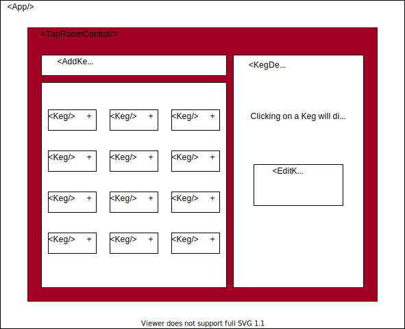

__Elminster's Potion Taproom Code Review__

by Ethan Firpo, 2020

## Description

This site is built to test understanding of basic CRUD functionality using React's library. It allows a user to play manager to a fictional taproom where magical potions are dispensed from kegs. The user can add, edit, and delete kegs from the shop's inventory, keep track of how many pints of each potion are sold and how many remain within each keg, and view details for each keg. Created as a code-review project for Epicodus' React/Redux course week 2. 

## Technology

HTML  
CSS  
JavaScript  
React.js  
JSX  

## Component Diagram

This project was bootstrapped with [Create React App](https://github.com/facebook/create-react-app).

### Available Scripts

In the project directory, you can run:

#### `npm start`

Runs the app in the development mode. 
Open [http://localhost:3000](http://localhost:3000) to view it in the browser.

The page will reload if you make edits. 
You will also see any lint errors in the console.

#### `npm test`

Launches the test runner in the interactive watch mode. 
See the section about [running tests](https://facebook.github.io/create-react-app/docs/running-tests) for more information.

#### `npm run build`

Builds the app for production to the `build` folder. 
It correctly bundles React in production mode and optimizes the build for the best performance.

The build is minified and the filenames include the hashes. 
Your app is ready to be deployed!

See the section about [deployment](https://facebook.github.io/create-react-app/docs/deployment) for more information.

#### `npm run eject`

**Note: this is a one-way operation. Once you `eject`, you can’t go back!**

If you aren’t satisfied with the build tool and configuration choices, you can `eject` at any time. This command will remove the single build dependency from your project.

Instead, it will copy all the configuration files and the transitive dependencies (webpack, Babel, ESLint, etc) right into your project so you have full control over them. All of the commands except `eject` will still work, but they will point to the copied scripts so you can tweak them. At this point you’re on your own.

## 